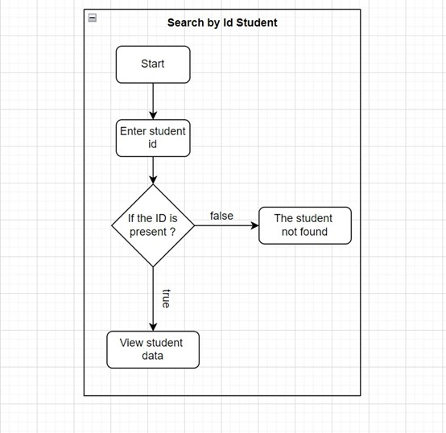
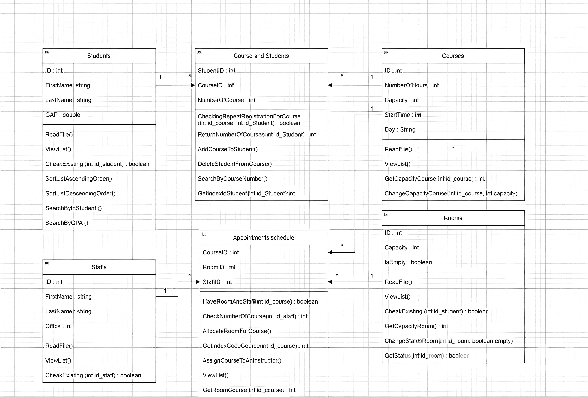

# Learning-Management-System-LMS-Academic-Software-Development
Java 
### Created by Rasha Alharbi
- **Email**: rashaalharbi220@gmail.com
  # About the Project
  
  

  

# Contribution
Feel free to suggest improvements or report issues by opening an issue on the repository. Forking the project or submitting pull requests requires prior permission from the owner. Please contact me before attempting to fork or make changes.
# License
This project is licensed under the MIT License. See the [MIT License](https://opensource.org/licenses/MIT) for more details.
